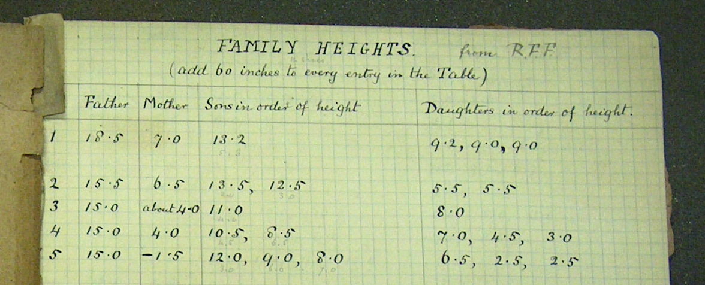

---
output:
  html_document:
    css: ~/KaplanFiles/DCF-Course-2014/CSS/DCF-Course-style.css
    fig_caption: yes
  pdf_document: default
---


# DCF Class Notes: Week 1

## Introduction: examples of contemporary data

### Taxicabs and the Shared Economy

A team of mathematicians and engineers has calculated that if taxi riders were willing to share a cab, New York City could reduce the current fleet of 13,500 taxis up to 40 percent. [Link to news story](http://www.nytimes.com/2014/09/02/science/sharing-taxis-nyc-mathematics.html) and an [interactive site](http://www.hubcab.org/) with the data.

* Traditional style: take a sample of taxi passengers.  Ask them where they got on and where they got off the taxi.
* New style: 
    * Every taxi transaction is registered, including GPS coordinates of flag up and flag down
    * A taxi-hailing app can register all calls for service, even those that aren't successful.

### Medicare Spending

Newspaper article [here](http://www.nytimes.com/2013/05/08/business/hospital-billing-varies-wildly-us-data-shows.html)

Data available [here](http://www.cms.gov/Research-Statistics-Data-and-Systems/Statistics-Trends-and-Reports/Medicare-Provider-Charge-Data/index.html).

[DTK notes](file:///Users/kaplan/KaplanFiles/MOSAIC/CVC/Summer2014/Notes/MedicareSpending/PriceOfHealth.html)

## The logic of this course

A very large part of the use and presentation of data draws on a small set of concepts and techniques.  These are not difficult individually and can be taught individually as simple manoeuvres.  In this way, they are simple, like Legos©. The complexity of data use and presentation comes from combining these concepts and techniques in various ways to achieve our specific purposes just as an elaborate model can be built out of simple blocks.

The individual lego bricks are simple.^[Source : "Lego Color Bricks" by Alan Chia - Lego Color Bricks. Licensed under CC BY-SA 2.0 via [Wikimedia Commons](http://commons.wikimedia.org/wiki/File:Lego_Color_Bricks.jpg#mediaviewer/File:Lego_Color_Bricks.jpg)]  | A city made by arranging lego bricks ^[Source: *Trafalgar Legoland 2003* by Kaihsu Tai - Kaihsu Tai. Licensed under CC BY-SA 3.0 via [Wikimedia Commons](http://commons.wikimedia.org/wiki/File:Trafalgar_Legoland_2003.jpg#mediaviewer/File:Trafalgar_Legoland_2003.jpg)]|
----------------- | --------------------  |
|  |


We're going to start today with the infrastructure for these techniques:

* the basic structure of data
* commanding the computer to handle data and present the story we want to tell, usually a combination of narration and graphic summary.  (There's also modeling, but that's more complicated and won't play a big role in this course.)

In coming weeks, we will study

* the relationship between data and graphical presentations
* the proper form of data to make a graphic (or a model) 
* how to wrangle the data we have into the form needed for a graphic
* some widely used forms for graphics, to give you some ideas for how you might want to present your own data to achieve your own purpose. 
* simple techniques to access data presented as web pages
* a couple of machine-learning techniques that illustrate how to deal with large numbers of variables


## Orientation to Class Resources

* R and RStudio. 
    R does the computations.  RStudio provides an interface to R that makes it easier to document your work, to access many of the features of R, and other things.
    * Macalester RStudio Server: <www.macalester.edu/rstudio>.  Login with your Macalester email name (e.g. `brosenberg`).  The initial password is the last 4 digits of your student ID number.  This can be changed.  [Instructions here](../FAQ.html#changing-your-password)
    * Installing on your own computer.  You need both of these:
        * [R software](http://cran.rstudio.com/)
        * [RStudio desktop software](http://www.rstudio.com/products/rstudio/download/preview/).

Packages: Run the script in [install_packages.R](install_packages.R)

```{r eval=FALSE}
source("http://dtkaplan.github.io/DCF-Course-2014/Notes/Week-1/install_packages.R")
```

* This includes the DCF-specific packages:
    * `devtools::install_github("dtkaplan/DCFdevel")`
    * `devtools::install_github("dtkaplan/DCFinteractive")`

* DCF Homepage is on Moodle.  

* An FAQ for the course: <http://dtkaplan.github.io/DCF-Course-2014/Notes/FAQ.html>. For questions of a general methodological nature, e.g. "How do I rename a variable?" please post the question on the Disqus discussion site.


### Examples from many fields

Data sets we will access regularly for examples.

<pre>
BabyNames                Names of children as recorded by the US Social
                         Security Administration.
CountryCentroids         Geographic location of countries
CountryData              Many variables on countries from the 2014 CIA factbook.
CountryGroups            Membership in Country Groups
DirectRecoveryGroups     
MedicareCharges          
MedicareProviders        
MigrationFlows           Human Migration between Countries
Minneapolis2013          Ballots in the 2013 Mayoral election in Minneapolis
NCI60                    Gene expression in cancer.
NCI60cells               Cell Line descriptions in the NCI-60 dataset
WorldCities              Cities and their populations
ZipDemography            Demographic information for most US ZIP Codes (Postal Codes)
ZipGeography             Geographic information by US Zip Codes (Postal Codes)
registeredVoters         A sample of the voter registration list for Wake County, North Carolina in Fall 2010.
</pre>

## Infrastructure

### Installation

1. RStudio
    a. Server <macalester.edu/rstudio> with your Mac email id and the last 4 digits of your student ID number.  (If there are leading zeros, try dropping them.)
    #. Desktop: install R from <www.r-project.org> and the RStudio preview edition from <rstudio.com>
#. Check for packages: devtools, ggplot2, dplyr, DCF (from Github), mosaicData, NHANES, DCFinteractive, mosaic, knitr, rmarkdown, rpart, shiny, manipulate.  [Here's a script](install_packages.R) that you can run to install these packages manually.


### RStudio

* Windows, panes, and tabs in RStudio.
* R/Markdown  
    * Opening an Rmd file for editing.
    * Saving Rmd files
    * Compiling Rmd to HTML
* Handing in files
    * Upload HTML files to Moodle.
    * Downloading from RStudio server to your desktop so that you can upload them to Moodle.

### Creating an Rmd File 

Using the DCF template file for Rmd.

Create an Rmd file named `Class-1.Rmd`.  Eventually, you will upload your HTML file to Moodle, under [In-class, Week 1](https://moodle.macalester.edu/mod/assign/view.php?id=19097)

Markdown for ...

* Headings, lists, mathematics
* Links, images
* R code chunks

TASK: Create an narrative description of your classes this term.  Include links to the Moodle site, links to a relevant Wikipedia (or other) article, and an embedded figure (perhaps from Wikipedia).

## Tidy Data

Basics: Cases, Variables, rows, columns, quantitative, categorical

### Exercises: Put these into tidy form.  

Divide into groups and put your answer to the following in these spreadsheets:[Group-1](https://docs.google.com/spreadsheet/ccc?key=0Am13enSalO74dHNpejZtd3dQTXlPM245R0ZQbG0yYkE&usp=sharing), [Group-2](https://docs.google.com/spreadsheet/ccc?key=0Am13enSalO74dHk1enZoVnhrV09ad2x4dXR1MlpWNFE&usp=sharing), [Group-3](https://docs.google.com/spreadsheet/ccc?key=0Am13enSalO74dElIQkh0SWtyaW9aRkdMZVBERHdJNXc#gid=0), [Group-4](https://docs.google.com/spreadsheet/ccc?key=0Am13enSalO74dEYxdEhWZUI1S3NxN2ZaaThXSEtMVWc&usp=sharing), [Group-5](https://docs.google.com/spreadsheet/ccc?key=0Am13enSalO74dDVsLWJaUHV5emFVQlVfSjFrdmFkYXc&usp=sharing), [Group-6](https://docs.google.com/spreadsheet/ccc?key=0Am13enSalO74dFdvNGpFZkNuUHZqd2g2UEVDc0VEZEE&usp=sharing)

Make a separate tab for each table.  Hand in your work [here on Moodle](https://moodle.macalester.edu/mod/assign/view.php?id=19097).  Work on the spreadsheets together with your group, but each student should individually create and hand in an Rmd->html document containing links to those spreadsheets (or the spreadsheets themselves.)    


#### Height measurements

In the 1880s, Francis Galton started to make a mathematical theory of evolution.  

Here's part of a page from his lab notebook.  




#### Marital status in the US armed forces

Here's the original, [untidy spreadsheet](https://docs.google.com/spreadsheets/d/1Ow6Cm4z-Z1Yybk3i352msulYCEDOUaOghmo9ALajyHo/edit#gid=1811988794).


## Back to your Week-1 Document

1. Add in answers to the above two questions, along with links to your group's spreadsheet.
#. Add in answers to the [Week-1 drill problems](http://dtkaplan.github.io/DCF-2014/Drill/Week-1.html)

When done, upload it to Moodle, under [In-class activity: RMD -> HTML](https://moodle.macalester.edu/mod/assign/view.php?id=19097).


## The assignment document for next week

Start on [Assignment 1](http://dtkaplan.github.io/DCF-2014/Assignments/Assignment-One).  

* Create an Rmd document named `AssignmentOne-XXX.Rmd` (where `XXX` is your initials).
* Eventually, by class next week, you'll hand it in on Moodle, [Week-1 Assignment hand in site](https://moodle.macalester.edu/mod/assign/view.php?id=19069).

We'll be done when you've uploaded at least the first part of your assignment to Moodle.  You can refine it later.


```{r child="../../CSS/DisqusTemplate.Rmd"}
```
